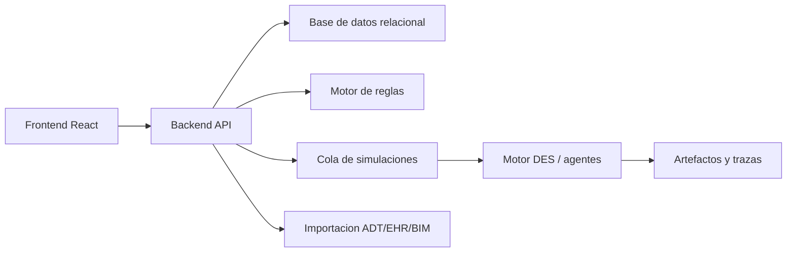

# Arquitectura de producto

## Decision principal

Si el objetivo es redisenar un hospital terciario desde cero, tiene sentido separar responsabilidades. El frontend debe ser una herramienta interactiva de diseno y simulacion visual; el backend debe custodiar proyectos, usuarios, versiones, escenarios y ejecuciones pesadas; el motor de simulacion debe poder evolucionar hacia DES, optimizacion y agentes sin quedar atrapado en la UI.

La app React actual es correcta para prototipar la experiencia tipo videojuego, pero no debe convertirse en el unico lugar donde viven los datos, las reglas y los modelos clinicos. Para un hospital tipo Vall d'Hebron o Clinic, la separacion es una condicion de mantenibilidad.



## Responsabilidades

| Capa | Responsabilidad | No deberia hacer |
|---|---|---|
| Frontend React + Phaser | Editor de plantas, pasillos editables, canvas 2D, simulacion visual top-down, configuracion de escenarios, comparacion de alternativas | Ser la fuente definitiva de permisos, reglas normativas o historico auditable |
| Backend API | Autenticacion, proyectos, versiones, permisos, catalogo, reglas, escenarios y resultados | Renderizar la experiencia visual o mezclar logica de presentacion |
| Motor de simulacion | DES, rutas, colas, ocupacion, flujos verticales, escenarios, agentes futuros | Persistir usuarios o acoplarse a componentes React |
| Motor de reglas | Requisitos arquitectonicos, PCI, accesibilidad, separacion de flujos, validaciones por jurisdiccion | Decidir estilos visuales o guardar sesiones de usuario |
| Datos | Planes, plantas, estancias, versiones, trazas, resultados y auditoria | Contener PHI innecesaria en fases de diseno |

## Estructura objetivo

```text
frontend/
  src/
    components/       Canvas, paneles y controles
    data/             Catalogo inicial editable desde backend en el futuro
    engine/           Simulacion ligera para preview
backend/
  app/
    api/              Endpoints REST/JSON
    domain/           Project, Plan, Room, RuleSet, SimulationRun
    services/         Versionado, validacion, permisos
    workers/          Lanzamiento de simulaciones
hospital_sim/backend/
  contracts.py        Contratos Pydantic implementados ahora
  adapters.py         Traduccion entre planes React y motor Python
  repository.py       Repositorio en memoria reemplazable
  services.py         Orquestacion de proyectos, reglas y simulaciones
  api.py              FastAPI actual
simulation/
  hospital_des/       Motor DES calibrable
  agents/             Modelos futuros de paciente, medico, enfermeria, celadores
  rules/              Evaluadores normativos versionados
docs/
  *.md
```

## Flujo de trabajo esperado

1. El usuario crea o abre un proyecto hospitalario.
2. El frontend carga catalogo, plantas, rooms y reglas activas desde el backend.
3. El usuario mueve o crea servicios en Vision.
4. El backend guarda una nueva version del plan.
5. El motor de reglas devuelve cumplimiento, avisos y evidencias.
6. El usuario lanza una simulacion.
7. El backend crea un job asincrono y devuelve progreso.
8. El motor DES/agentes genera KPIs, trazas y replay.
9. El frontend reproduce la simulacion como videojuego 2D y compara alternativas.

## Principios de diseno

- El layout hospitalario es un dato versionado, no solo estado local del navegador.
- La geometria debe mantener ancho, alto y area derivados entre si. En la UI actual, 1 unidad de plano equivale a 3 m y cada celda cuadrada equivale a 9 m2.
- Las reglas deben ser explicables: cada alerta necesita evidencia, planta afectada y severidad.
- La simulacion debe ser determinista por semilla para comparar alternativas.
- El replay visual debe seguir la misma red de circulacion que el motor de rutas: puerta, pasillo, interseccion, conector vertical y puerta de destino.
- Los escenarios deben guardar parametros, version del plan, version del motor y version de reglas.
- La UI puede tener simulacion ligera en cliente, pero los resultados oficiales deben venir de backend.
- La futura simulacion de personas debe entrar como perfiles de agentes, no como hacks visuales dentro del canvas.
- El ranking de usuarios debe separar preview local y resultado oficial: la UI puede mostrar un top inmediato, pero el backend debe guardar propuesta, usuario, version del plan, parametros de simulacion y score auditado.

## Decision sobre 2D, 3D y plantas

Para esta etapa conviene mantener una vista 2D tipo videojuego como vista principal. Es mas clara para disenar servicios, habitaciones, pasillos, halls, esperas, ambulancias, ascensores, escaleras y evacuacion horizontal. La implementacion usa Phaser 3 dentro de React para que el simulador tenga capas, sprites, camara y estilo top-down RPG. Three.js puede tener sentido mas adelante para una vista ejecutiva 3D o revision volumetrica, pero la base operativa debe seguir siendo planta por planta, con recorridos verticales medibles.

La representacion multi-planta debe tratar ascensores/montacargas y escaleras como familias separadas de conectores reales entre plantas. Cada conector vertical debe tener una familia estable, una lista de plantas conectadas y una huella consistente en esas plantas, salvo cuando se modele explicitamente como otro tramo o familia. En simulacion, esos conectores deben tener capacidad, tiempos, colas y restricciones de uso: publico, camas, limpio, sucio, emergencia, mantenimiento y bomberos.

## Reglas de edicion espacial actuales

- Todos los bloques pueden moverse y redimensionarse desde Vision o desde el inspector.
- Los m2 no se editan manualmente: se calculan desde ancho x alto para evitar incoherencias al comparar alternativas.
- Los pasillos son bloques de circulacion editables y se crean desde el selector `Elemento`, no desde botones separados. Una sala queda conectada solo si tiene una puerta en su perimetro y esa puerta toca un pasillo de la misma planta.
- Al crear o mover una puerta, el editor aplica un efecto iman: fuera del radio de captura la puerta se mueve libre por la pared; dentro del radio se pega al bloque de pasillo cercano y crea o actualiza un umbral de circulacion estable asociado a esa puerta.
- El color rojo en puertas indica que la puerta no toca ningun pasillo. El borde rojo en pasillos indica que ese tramo esta aislado de la red principal.
- El boton de auto-conexion crea una primera propuesta de conector de pasillo entre una sala sin acceso y el pasillo mas cercano. Es una ayuda de trazado, no una validacion normativa.
- Los conectores verticales usan botones de planta: `Solo esta`, `Tramo +1` y `Todas`. Ascensores/montacargas y escaleras se modelan como componentes distintos; un tramo puede conectar solo 0-1, 1-2, o cualquier conjunto explicito, y si se usa la misma familia en varias plantas debe mantener huella y posicion.
- En Vision, las escaleras no se pintan como equipamiento interno. El bloque de escalera es la pieza arquitectonica; evitar iconos internos reduce duplicidades visuales al disenar.

## Ranking de arquitecturas

La pestana `Top` compara propuestas por autor con un score de 0 a 100 calculado desde la simulacion actual. La formula inicial penaliza pacientes bloqueados, espera P90 de urgencias, traslado medio, cambios de planta, reglas arquitectonicas abiertas y desviacion respecto a los m2 objetivo. Las propuestas demo sirven para probar la experiencia; las propuestas guardadas registran el estado actual del plano en memoria local.

La fase productiva debe mover este ranking al backend para evitar manipulacion de resultados, comparar solo simulaciones con la misma version de parametros y guardar historico por usuario/proyecto.
