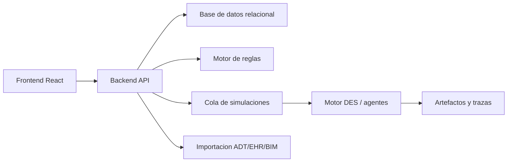

# Arquitectura de producto

## Decision principal

Si el objetivo es redisenar un hospital terciario desde cero, tiene sentido separar responsabilidades. El frontend debe ser una herramienta interactiva de diseno y simulacion visual; el backend debe custodiar proyectos, usuarios, versiones, escenarios y ejecuciones pesadas; el motor de simulacion debe poder evolucionar hacia DES, optimizacion y agentes sin quedar atrapado en la UI.

La app React actual es correcta para prototipar la experiencia tipo videojuego, pero no debe convertirse en el unico lugar donde viven los datos, las reglas y los modelos clinicos. Para un hospital tipo Vall d'Hebron o Clinic, la separacion es una condicion de mantenibilidad.



## Responsabilidades

| Capa | Responsabilidad | No deberia hacer |
|---|---|---|
| Frontend React | Editor de plantas, canvas 2D, simulacion visual, configuracion de escenarios, comparacion de alternativas | Ser la fuente definitiva de permisos, reglas normativas o historico auditable |
| Backend API | Autenticacion, proyectos, versiones, permisos, catalogo, reglas, escenarios y resultados | Renderizar la experiencia visual o mezclar logica de presentacion |
| Motor de simulacion | DES, rutas, colas, ocupacion, flujos verticales, escenarios, agentes futuros | Persistir usuarios o acoplarse a componentes React |
| Motor de reglas | Requisitos arquitectonicos, PCI, accesibilidad, separacion de flujos, validaciones por jurisdiccion | Decidir estilos visuales o guardar sesiones de usuario |
| Datos | Planes, plantas, estancias, versiones, trazas, resultados y auditoria | Contener PHI innecesaria en fases de diseno |

## Estructura objetivo

```text
frontend/
  src/
    components/       Canvas, paneles y controles
    data/             Catalogo inicial editable desde backend en el futuro
    engine/           Simulacion ligera para preview
backend/
  app/
    api/              Endpoints REST/JSON
    domain/           Project, Plan, Room, RuleSet, SimulationRun
    services/         Versionado, validacion, permisos
    workers/          Lanzamiento de simulaciones
simulation/
  hospital_des/       Motor DES calibrable
  agents/             Modelos futuros de paciente, medico, enfermeria, celadores
  rules/              Evaluadores normativos versionados
docs/
  *.md
```

## Flujo de trabajo esperado

1. El usuario crea o abre un proyecto hospitalario.
2. El frontend carga catalogo, plantas, rooms y reglas activas desde el backend.
3. El usuario mueve o crea servicios en Vision.
4. El backend guarda una nueva version del plan.
5. El motor de reglas devuelve cumplimiento, avisos y evidencias.
6. El usuario lanza una simulacion.
7. El backend crea un job asincrono y devuelve progreso.
8. El motor DES/agentes genera KPIs, trazas y replay.
9. El frontend reproduce la simulacion como videojuego 2D y compara alternativas.

## Principios de diseno

- El layout hospitalario es un dato versionado, no solo estado local del navegador.
- Las reglas deben ser explicables: cada alerta necesita evidencia, planta afectada y severidad.
- La simulacion debe ser determinista por semilla para comparar alternativas.
- Los escenarios deben guardar parametros, version del plan, version del motor y version de reglas.
- La UI puede tener simulacion ligera en cliente, pero los resultados oficiales deben venir de backend.
- La futura simulacion de personas debe entrar como perfiles de agentes, no como hacks visuales dentro del canvas.

## Decision sobre 2D, 3D y plantas

Para esta etapa conviene mantener una vista 2D tipo videojuego como vista principal. Es mas clara para disenar servicios, habitaciones, halls, esperas, ambulancias, ascensores, escaleras y evacuacion horizontal. Three.js puede tener sentido mas adelante para una vista ejecutiva 3D o revision volumetrica, pero el nucleo operativo debe seguir siendo planta por planta, con recorridos verticales medibles.

La representacion multi-planta debe tratar ascensores, montacargas y escaleras como conectores reales entre plantas. En simulacion, esos conectores deben tener capacidad, tiempos, colas y restricciones de uso: publico, camas, limpio, sucio, emergencia, mantenimiento y bomberos.
